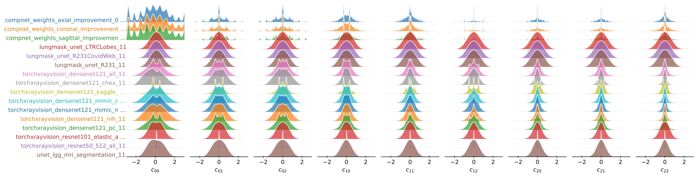

# Does Medical Imaging learn different Convolution Filters?
Paul Gavrikov, Janis Keuper

[![CC BY-SA 4.0][cc-by-sa-shield]][cc-by-sa]

Presented at: [Conference]

<!-- [Paper]() | [ArXiv]() | [HQ Poster]() -->
Links coming soon.


Abstract: *Recent work has investigated the distributions of learned convolution filters through a large-scale study containing hundreds of heterogeneous image models. Surprisingly, on average, the distributions only show minor drifts in comparisons of various studied dimensions including the learned task, image domain, or dataset. However, among the studied image domains, medical imaging models appeared to show significant outliers through "spikey" distributions, and, therefore, learn clusters of highly specific filters different from other domains. Following this observation, we study the collected medical imaging models in more detail. We show that instead of fundamental differences, the outliers are due to specific processing in some architectures. Quite the contrary, for standardized architectures, we find that models trained on medical data do not significantly differ in their filter distributions from similar architectures trained on data from other domains. Our conclusions reinforce previous hypotheses stating that pre-training of imaging models can be done with any kind of diverse image data.*


[cc-by-sa]: http://creativecommons.org/licenses/by-sa/4.0/
[cc-by-sa-image]: https://licensebuttons.net/l/by-sa/4.0/88x31.png
[cc-by-sa-shield]: https://img.shields.io/badge/License-CC%20BY--SA%204.0-lightgrey.svg




## Reproduce our results

1. Download *CNN Filter DB* from https://doi.org/10.5281/zenodo.6371680
2. Run our juypter notebook [analysis.ipynb](analysis.ipynb)


## Citation 

If you find our work useful in your research, please consider citing:

```
```
and

```
@InProceedings{Gavrikov_2022_CVPR,
    author    = {Gavrikov, Paul and Keuper, Janis},
    title     = {CNN Filter DB: An Empirical Investigation of Trained Convolutional Filters},
    booktitle = {Proceedings of the IEEE/CVF Conference on Computer Vision and Pattern Recognition (CVPR)},
    month     = {June},
    year      = {2022},
    pages     = {19066-19076}
}
```

### Legal
This work is licensed under a
[Creative Commons Attribution-ShareAlike 4.0 International License][cc-by-sa].
